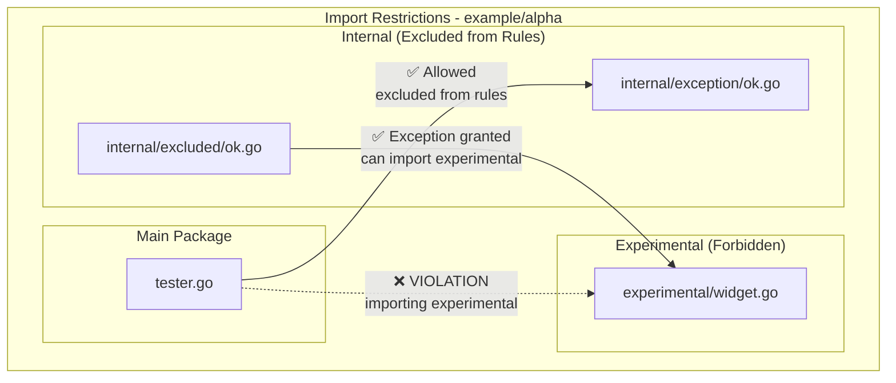

# Example (alpha)

**Basic Import Restrictions with Exclusions:**
- **Forbidden Imports**: Packages cannot import from `experimental/**` directory 
- **Package Exclusions**: Certain directories can be excluded from rule enforcement
- **Selective Exceptions**: Specific packages can be exempted from restrictions

**Enforced Rules:**
- **No Experimental Imports**: All packages under `alpha/**` are forbidden from importing `experimental` modules
- **Exclusion Pattern**: Packages under `internal/exception/**` are excluded from rule enforcement entirely
- **Exception Handling**: Only `internal/excluded` package is allowed to import experimental code

**Current Violations Detected by arch-lint:**
1. **Prohibited Import**: `tester.go` imports `experimental/widget`, violating the no-experimental-imports rule
2. **Exception Import**: `tester.go` imports `internal/exception`, but this is excluded from rules

