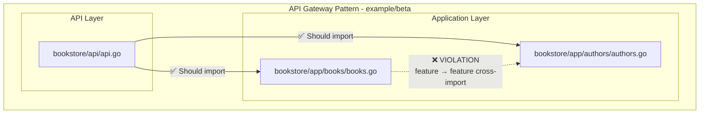

# Example (beta)

**Layered Architecture with API Gateway Pattern:**
- **API Layer**: Central access point that can import from application modules
- **Application Modules**: Core business logic modules (`app/**`) that should be accessed only through API
- **Import Restrictions**: Application modules cannot directly import each other

**Enforced Rules:**
- **API-Only Access**: All packages under `bookstore/**` are forbidden from importing `app/**` modules
- **API Exception**: Only the `api/**` package is allowed to import application modules

**Current Violations Detected by arch-lint:**
1. **Cross-Module Import**: `app/books/books.go` directly imports `app/authors`, bypassing the API layer

