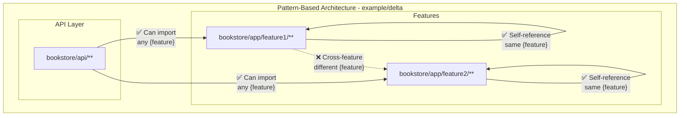

# Example (delta)

**Feature-Specific API Access with Pattern Matching:**
- **Pattern-Based Rules**: Uses `{feature}` placeholder for dynamic pattern matching
- **Feature-Specific Access**: API can access feature-specific application modules
- **Self-Reference Allowance**: Features can reference themselves through the pattern

**Enforced Rules:**
- **Feature-Specific Restrictions**: Packages are forbidden from importing `app/{feature}/**` modules
- **API Exception**: Only `api/**` packages can import feature-specific modules
- **Self-Reference Exception**: `app/{feature}/**` modules can import themselves (same feature)

**Pattern Matching Features:**
- **Dynamic Patterns**: `{feature}` acts as a placeholder that matches actual feature names
- **Self-Referential Logic**: The same `{feature}` value in both forbid and except creates self-import allowance

