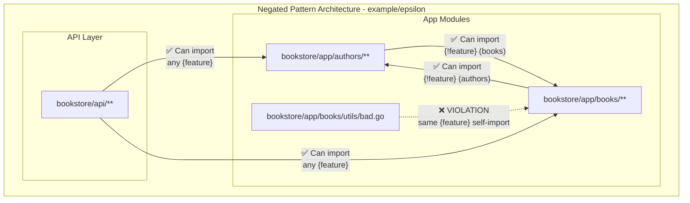

# Example (epsilon)

**Advanced Pattern Matching with Negation:**
- **Negated Patterns**: Uses `{!feature}` to match "anything except the current feature"
- **Cross-Module Communication**: App modules can import other modules using negation patterns
- **Bidirectional Access**: Unlike other examples, modules can import each other when using `{!feature}`

**Enforced Rules:**
- **Feature-Specific Restrictions**: Packages are forbidden from importing `app/{feature}/**` modules
- **API Access**: Only `api/**` packages can import any feature modules
- **Non-Feature Access**: `app/{!feature}/**` allows imports from anything that's not the same feature

**Current Violations Detected by arch-lint:**
1. **Self-Import Violation**: `app/books/utils/bad.go` imports `app/books`, violating the `{!feature}` rule (utils is part of books feature)

**Pattern Matching Features:**
- **Negation Pattern**: `{!feature}` matches all modules except those with the same feature name
- **Flexible Architecture**: Allows cross-module imports while preventing self-imports

