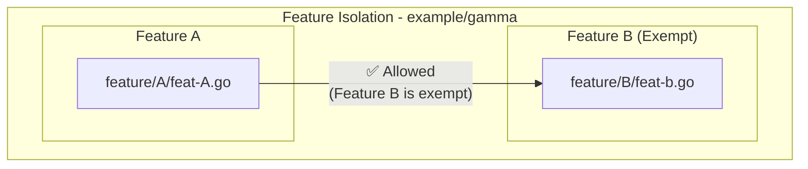

# Example (gamma)

**Feature Isolation with Exemptions:**
- **Feature Separation**: Features should be isolated and cannot import each other
- **Selective Exemptions**: Specific features can be granted exemptions from isolation rules
- **Module Independence**: Promotes loose coupling between feature modules

**Enforced Rules:**
- **No Cross-Feature Imports**: Features under `feature/*` are forbidden from importing other features (`feature/*`)
- **Feature B Exemption**: Feature B is exempt from the isolation rule and can be imported by others

**Current Violations Detected by arch-lint:**
1. **Feature Cross-Import**: `feature/A/feat-A.go` imports `feature/B`, but Feature B is exempted so this should be allowed

