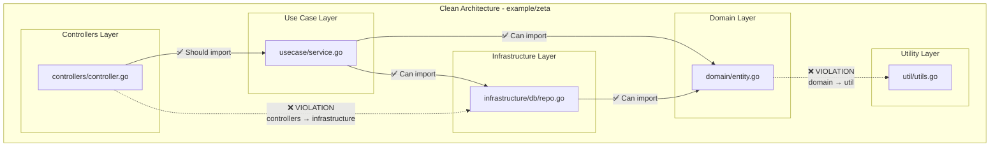

# Example (zeta)

**Proper Clean Architecture with Utilities:**
- **Utilities** can be imported by Controllers, Use Cases, and Infrastructure
- **Domain** remains completely independent (no imports allowed)
- **Controllers** should depend on Use Cases, not Infrastructure directly
- **Use Cases** orchestrate domain logic and can use utilities
- **Infrastructure** implements domain interfaces and can use utilities

**Enforced Rules:**
- **Domain Independence**: Domain layer (`domain/**`) is forbidden from importing anything (`"**"`), including utilities
- **Controller Isolation**: Controllers (`controllers/**`) are forbidden from importing infrastructure (`infrastructure/**`)

**Current Violations Detected by arch-lint:**
1. **Controllers → Infrastructure**: `controllers/controller.go` directly imports `infrastructure/db`, bypassing the use case layer
2. **Domain → Util**: `domain/entity.go` imports `util`, violating domain independence

